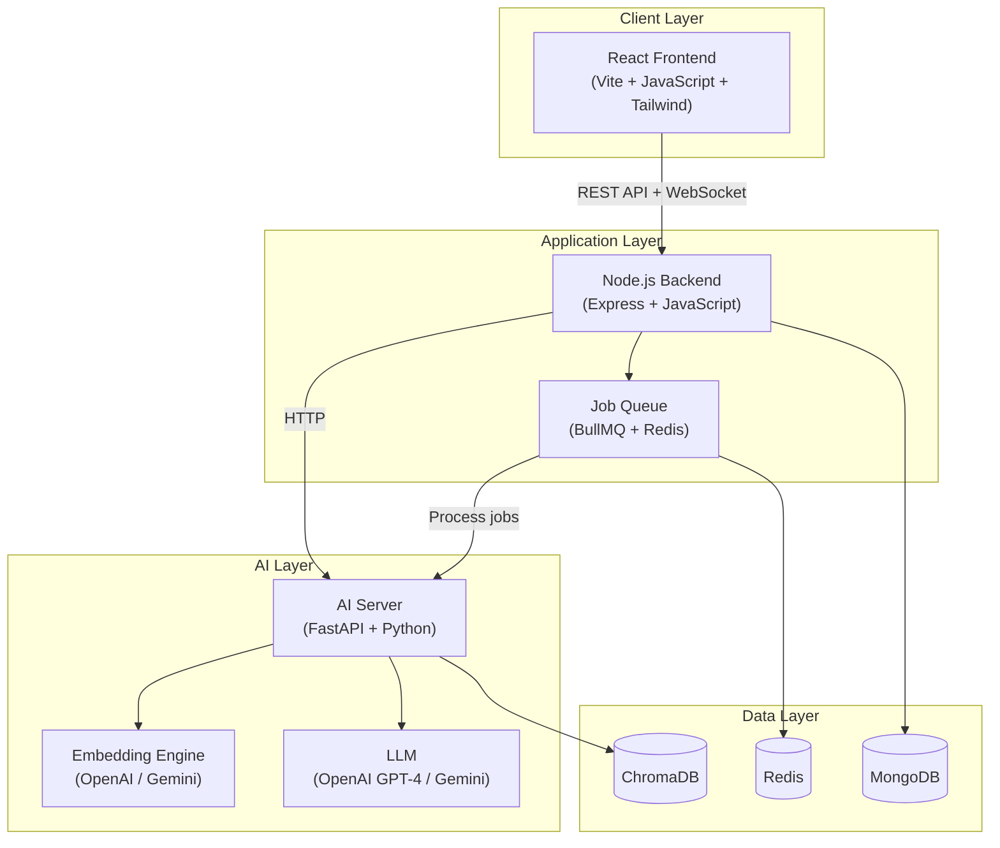
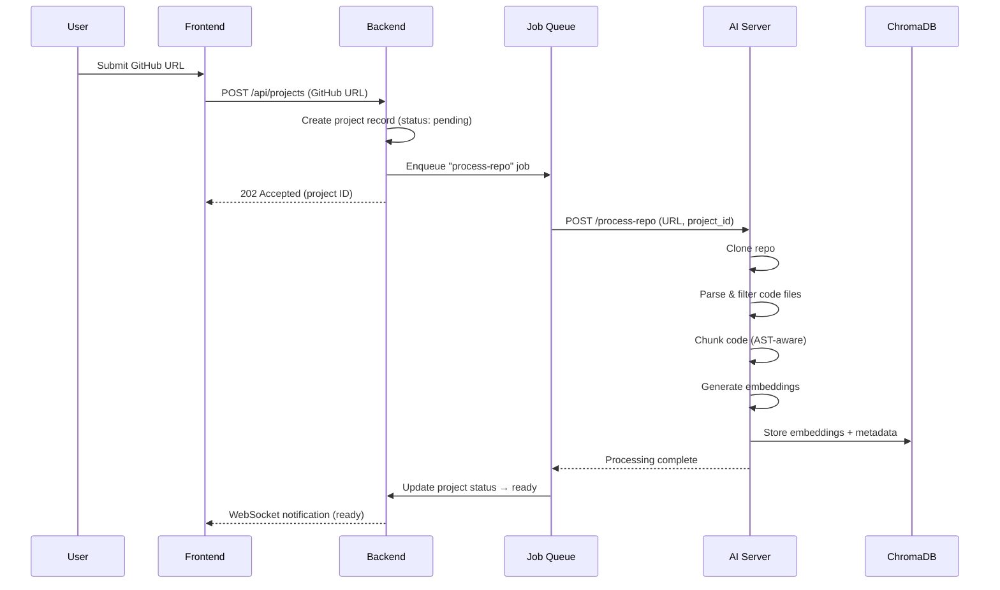
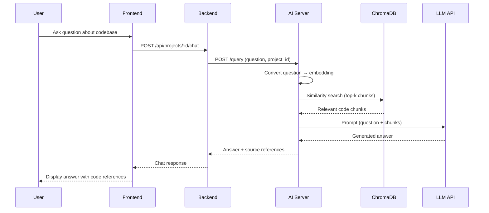

# Autonomous Codebase Documentor — System Design & Implementation Plan

An AI-powered system that analyzes GitHub repositories, generates documentation automatically, and lets users chat with a codebase using RAG (Retrieval Augmented Generation). This plan covers everything needed to go from empty directories to a production-ready deployment.

---

## 1. High-Level Architecture



### Data Flow — Repo Processing Pipeline



### Data Flow — Chat / Query Pipeline



---

## 2. Directory Structure — All Services

### AI Server (`ai-server/`)

```
ai-server/
├── app/
│   ├── __init__.py
│   ├── main.py                 # FastAPI app entry
│   ├── config.py               # Settings (Pydantic BaseSettings)
│   ├── api/
│   │   ├── __init__.py
│   │   ├── routes/
│   │   │   ├── health.py       # GET /health
│   │   │   ├── process.py      # POST /process-repo
│   │   │   ├── query.py        # POST /query
│   │   │   └── docs.py         # POST /generate-docs
│   ├── services/
│   │   ├── __init__.py
│   │   ├── repo_cloner.py      # Git clone + cleanup
│   │   ├── file_parser.py      # Traverse & filter files
│   │   ├── code_chunker.py     # AST-aware code chunking
│   │   ├── embedding.py        # Embedding generation
│   │   ├── vector_store.py     # ChromaDB operations
│   │   ├── rag_pipeline.py     # Retrieval + LLM orchestration
│   │   └── doc_generator.py    # Documentation generation
│   ├── models/
│   │   ├── __init__.py
│   │   └── schemas.py          # Pydantic request/response models
│   └── utils/
│       ├── __init__.py
│       └── logger.py           # Structured logging
├── tests/
│   ├── test_chunker.py
│   ├── test_parser.py
│   └── test_rag.py
├── requirements.txt
├── Dockerfile
└── .env.example
```

### Backend (`backend/`)

```
backend/
├── src/
│   ├── app.js                  # Express app setup
│   ├── server.js               # HTTP server entry
│   ├── config/
│   │   ├── index.js            # Env config loader
│   │   └── db.js               # MongoDB connection
│   ├── middleware/
│   │   ├── auth.js             # JWT verification
│   │   ├── errorHandler.js     # Global error handler
│   │   ├── rateLimiter.js      # Rate limiting
│   │   └── validate.js         # Request validation (using standard JS)
│   ├── modules/
│   │   ├── auth/
│   │   │   ├── auth.controller.js
│   │   │   ├── auth.service.js
│   │   │   ├── auth.routes.js
│   │   │   └── auth.validation.js
│   │   ├── project/
│   │   │   ├── project.controller.js
│   │   │   ├── project.service.js
│   │   │   ├── project.model.js    # Mongoose schema
│   │   │   ├── project.routes.js
│   │   │   └── project.validation.js
│   │   ├── chat/
│   │   │   ├── chat.controller.js
│   │   │   ├── chat.service.js
│   │   │   ├── chat.model.js
│   │   │   ├── chat.routes.js
│   │   │   └── chat.validation.js
│   │   └── user/
│   │       ├── user.model.js
│   │       └── user.service.js
│   ├── jobs/
│   │   ├── queue.js            # BullMQ queue setup
│   │   └── processRepo.job.js  # Repo processing worker
│   ├── socket/
│   │   └── index.js            # Socket.IO for real-time updates
│   └── utils/
│       └── logger.js           # Winston logger
├── tests/
│   ├── auth.test.js
│   └── project.test.js
├── package.json
├── Dockerfile
└── .env.example
```

### Frontend (`frontend/`)

```
frontend/
├── public/
├── src/
│   ├── main.jsx
│   ├── App.jsx
│   ├── index.css               # Global styles + Tailwind directives
│   ├── api/
│   │   ├── client.js           # Axios instance with interceptors
│   │   ├── auth.api.js
│   │   ├── project.api.js
│   │   └── chat.api.js
│   ├── components/
│   │   ├── ui/                 # Reusable primitives (Button, Input, Card...)
│   │   ├── layout/
│   │   │   ├── Sidebar.jsx
│   │   │   ├── Header.jsx
│   │   │   └── DashboardLayout.jsx
│   │   ├── chat/
│   │   │   ├── ChatWindow.jsx
│   │   │   ├── MessageBubble.jsx
│   │   │   └── ChatInput.jsx
│   │   └── docs/
│   │       ├── DocViewer.jsx
│   │       └── FileTree.jsx
│   ├── pages/
│   │   ├── Login.jsx
│   │   ├── Register.jsx
│   │   ├── Dashboard.jsx
│   │   ├── ProjectDetail.jsx
│   │   ├── ChatPage.jsx
│   │   └── DocsPage.jsx
│   ├── hooks/
│   │   ├── useAuth.js
│   │   ├── useSocket.js
│   │   └── useProject.js
│   ├── store/
│   │   └── authStore.js        # Zustand store
│   └── utils/
│       └── constants.js
├── package.json
├── tailwind.config.js
├── vite.config.js
├── Dockerfile
└── .env.example
```

---

## 3. Database Schema Design (MongoDB)

### `users` collection

| Field          | Type     | Notes                          |
|----------------|----------|--------------------------------|
| `_id`          | ObjectId | Auto                           |
| `email`        | String   | Unique, indexed                |
| `passwordHash` | String   | bcrypt hashed                  |
| `name`         | String   |                                |
| `plan`         | String   | `"free"` / `"pro"` (future)    |
| `createdAt`    | Date     |                                |
| `updatedAt`    | Date     |                                |

### `projects` collection

| Field            | Type     | Notes                                       |
|------------------|----------|---------------------------------------------|
| `_id`            | ObjectId | Auto                                        |
| `userId`         | ObjectId | Ref → users, indexed                        |
| `name`           | String   | Display name                                |
| `repoUrl`        | String   | GitHub URL                                  |
| `status`         | String   | `pending` / `processing` / `ready` / `failed` |
| `fileCount`      | Number   | Total parsed files                          |
| `chunkCount`     | Number   | Total chunks created                        |
| `language`       | String   | Primary language detected                   |
| `errorMessage`   | String   | If status = failed                          |
| `chromaCollection`| String  | Collection name in ChromaDB                 |
| `processedAt`    | Date     |                                             |
| `createdAt`      | Date     |                                             |
| `updatedAt`      | Date     |                                             |

### `chatSessions` collection

| Field        | Type     | Notes              |
|--------------|----------|--------------------|
| `_id`        | ObjectId | Auto               |
| `projectId`  | ObjectId | Ref → projects     |
| `userId`     | ObjectId | Ref → users        |
| `title`      | String   | Auto-generated     |
| `messages`   | Array    | Embedded documents |
| `createdAt`  | Date     |                    |
| `updatedAt`  | Date     |                    |

**Message sub-document:**

| Field      | Type   | Notes                      |
|------------|--------|----------------------------|
| `role`     | String | `"user"` / `"assistant"`   |
| `content`  | String | Message text               |
| `sources`  | Array  | `[{file, line, snippet}]`  |
| `timestamp`| Date   |                            |

---

## 4. API Contracts

### Backend REST API (Express)

| Method | Route                          | Auth | Description                |
|--------|--------------------------------|------|----------------------------|
| POST   | `/api/auth/register`           | No   | Create account             |
| POST   | `/api/auth/login`              | No   | Login, return JWT          |
| GET    | `/api/auth/me`                 | Yes  | Get current user           |
| POST   | `/api/projects`                | Yes  | Create project (add repo)  |
| GET    | `/api/projects`                | Yes  | List user's projects       |
| GET    | `/api/projects/:id`            | Yes  | Get project detail         |
| DELETE | `/api/projects/:id`            | Yes  | Delete project + vectors   |
| GET    | `/api/projects/:id/docs`       | Yes  | Get generated docs         |
| POST   | `/api/projects/:id/chat`       | Yes  | Send chat message          |
| GET    | `/api/projects/:id/chat`       | Yes  | Get chat history           |

### AI Server API (FastAPI)

| Method | Route                          | Description                                |
|--------|--------------------------------|--------------------------------------------|
| GET    | `/health`                      | Health check                               |
| POST   | `/process-repo`                | Clone, parse, chunk, embed, store          |
| POST   | `/query`                       | RAG query (question → answer)              |
| POST   | `/generate-docs`               | Generate documentation for project         |
| DELETE | `/collections/{collection_id}` | Delete vector collection                   |

#### Key Request/Response Schemas

**POST `/process-repo`**
```json
// Request
{
  "repo_url": "https://github.com/user/repo",
  "project_id": "abc123",
  "file_extensions": [".js", ".py", ".jsx", ".tsx"],
  "primary_language": "JavaScript"
}
```

**POST `/query`**
```json
// Request
{
  "question": "How does authentication work?",
  "project_id": "abc123",
  "top_k": 5
}
// Response
{
  "answer": "Authentication uses JWT tokens...",
  "sources": [
    {"file": "src/auth/login.js", "line": 12, "snippet": "..."}
  ]
}
```

---

## 5. Key Design Decisions

### Code Chunking Strategy

> [!IMPORTANT]
> Naive line-based splitting destroys context. We use a **hybrid strategy**:

1. **AST-aware chunking** (primary): Use `tree-sitter` to split by functions/classes/methods
2. **Sliding window fallback**: For unparseable files — 512 tokens, 128 overlap
3. **Metadata enrichment**: Each chunk stores `{file_path, start_line, end_line, language, parent_class}`

### Embedding Model

| Option           | Dims  | Cost         | Quality   |
|------------------|-------|--------------|-----------|
| `text-embedding-3-small` (OpenAI) | 1536 | $0.02/1M tokens | Good |
| Gemini `text-embedding-004`       | 768  | Free tier    | Good      |

**Recommendation**: Start with **Gemini `text-embedding-004`** for cost-efficiency, make configurable.

### LLM Selection

| Option       | Context Window | Cost              |
|--------------|----------------|-------------------|
| GPT-4o-mini  | 128K           | $0.15/$0.60 /1M   |
| Gemini 2.0 Flash | 1M       | Free tier available|

**Recommendation**: **Gemini 2.0 Flash** for MVP with swappable LLM client.

### Vector Store — ChromaDB

Open-source, self-hosted, Python-native, supports metadata filtering by `project_id` / `language` / `file_path`.

---

## 6. Production Readiness Checklist

### Security
- JWT auth with refresh tokens + bcrypt password hashing (12 rounds)
- Input validation on all endpoints (Zod for backend, Pydantic for AI)
- Rate limiting (per-user, per-IP) + CORS whitelist + Helmet.js headers
- Sanitize GitHub URLs (prevent SSRF — only allow `github.com`)
- File extension whitelist (prevent processing binaries/secrets)

### Reliability
- Async job queue (BullMQ) for repo processing — never block HTTP
- Retry with exponential backoff on LLM/embedding API calls
- Failed repos marked with `status: failed` + error message
- Health checks on all services + DB connection pooling + request timeouts

### Observability
- Structured JSON logging (Winston + Python `structlog`)
- Request ID tracing across services
- Processing time metrics + error alerting

### Performance
- Redis caching for repeated queries
- Paginated API responses
- Frontend lazy loading + code splitting + debounced chat input

---

## 7. Docker Compose Setup

```yaml
services:
  frontend:
    build: ./frontend
    ports: ["3000:3000"]
    depends_on: [backend]

  backend:
    build: ./backend
    ports: ["5000:5000"]
    depends_on: [mongodb, redis]
    environment:
      - MONGODB_URI=mongodb://mongodb:27017/codebase-doc
      - REDIS_URL=redis://redis:6379
      - AI_SERVER_URL=http://ai-server:8000
      - JWT_SECRET=${JWT_SECRET}

  ai-server:
    build: ./ai-server
    ports: ["8000:8000"]
    depends_on: [chromadb]
    environment:
      - CHROMA_HOST=chromadb
      - GEMINI_API_KEY=${GEMINI_API_KEY}
    volumes:
      - repo-clones:/tmp/repos

  mongodb:
    image: mongo:7
    ports: ["27017:27017"]
    volumes: [mongo-data:/data/db]

  redis:
    image: redis:7-alpine
    ports: ["6379:6379"]

  chromadb:
    image: chromadb/chroma:latest
    ports: ["8001:8000"]
    volumes: [chroma-data:/chroma/chroma]

volumes:
  mongo-data:
  chroma-data:
  repo-clones:
```

---

## 8. Environment Variables

### AI Server
```
GEMINI_API_KEY=             # Required
CHROMA_HOST=localhost
CHROMA_PORT=8000
EMBEDDING_MODEL=models/text-embedding-004
LLM_MODEL=gemini-2.0-flash
MAX_CHUNK_TOKENS=512
CLONE_DIR=/tmp/repos
LOG_LEVEL=INFO
```

### Backend
```
PORT=5000
MONGODB_URI=mongodb://localhost:27017/codebase-doc
REDIS_URL=redis://localhost:6379
AI_SERVER_URL=http://localhost:8000
JWT_SECRET=                 # Required
JWT_EXPIRY=7d
CORS_ORIGIN=http://localhost:3000
LOG_LEVEL=info
```

### Frontend
```
VITE_API_URL=http://localhost:5000/api
VITE_WS_URL=http://localhost:5000
```

---

## 9. Phased Implementation Order

> [!TIP]
> Build bottom-up: Data layer → AI layer → Backend → Frontend.

### Phase 1 — AI Server (Week 1)
1. Scaffold FastAPI project + config + health check
2. `repo_cloner.py` — clone GitHub repos to temp dir
3. `file_parser.py` — traverse & filter by extensions
4. `code_chunker.py` — AST-aware chunking with tree-sitter
5. `embedding.py` — generate embeddings via Gemini API
6. `vector_store.py` — ChromaDB CRUD
7. `rag_pipeline.py` — similarity search + LLM query
8. Wire up API routes + write unit tests

### Phase 2 — Backend (Week 2)
1. Scaffold Express + JavaScript + MongoDB connection
2. Auth module (register, login, JWT middleware)
3. Project module (CRUD, status tracking)
4. Chat module (send message, get history)
5. BullMQ job queue + repo processing worker
6. Socket.IO for real-time status + middleware setup
7. Write integration tests

### Phase 3 — Frontend (Week 3)
1. Scaffold Vite + React + JS + Tailwind
2. Routing, API client, auth store (Zustand)
3. Auth pages + Dashboard + upload form
4. Documentation Viewer + Chat page
5. Real-time status via Socket.IO + UI polish

### Phase 4 — Integration & Production (Week 4)
1. Docker Compose for all services
2. End-to-end testing
3. Security audit + performance tuning + README

---

## 10. Verification Plan

### Automated Tests

**AI Server:**
```bash
cd ai-server && pip install -r requirements.txt && pytest tests/ -v
```
- `test_parser.py` — file filtering picks only code files
- `test_chunker.py` — AST chunking produces correct boundaries
- `test_rag.py` — RAG pipeline returns relevant results (mock LLM)

**Backend:**
```bash
cd backend && npm install && npm test
```
- `auth.test.js` — register, login, JWT validation flows
- `project.test.js` — CRUD, status transitions

### Integration Testing
1. `docker-compose up` all services
2. Register user → login → get JWT
3. Create project with small public GitHub repo
4. Poll status until `ready`
5. Send chat query, verify response has code references

### Manual Verification
1. **Upload Flow**: Submit GitHub URL, confirm status: `pending` → `processing` → `ready`
2. **Chat Flow**: Ask "What does the main function do?", verify answer references actual code
3. **Error Flow**: Submit invalid/private URL, verify user-friendly error message
