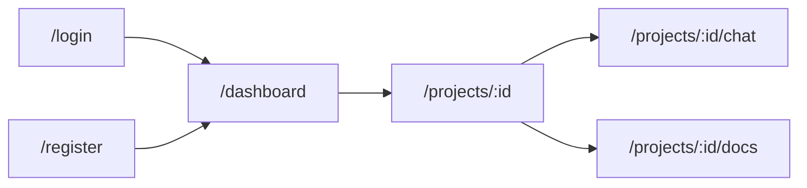

# Phase 3: Frontend Implementation Plan — Autonomous Codebase Documentor

## Current Status

| Layer | Status |
|-------|--------|
| AI Server (FastAPI + Python) | ✅ Done |
| Backend (Express + Node.js) | ✅ Done |
| **Frontend (React + Vite)** | **⬜ Not Started** |

---

## Tech Stack

| Technology | Role |
|------------|------|
| **React 18** | UI library |
| **Vite** | Build tool & dev server |
| **JavaScript** | Language |
| **Tailwind CSS** | Utility-first styling |
| **React Router v6** | Client-side routing |
| **Zustand** | Lightweight state management |
| **Axios** | HTTP client with interceptors |
| **Socket.IO Client** | Real-time status updates |
| **React Hot Toast** | Toast notifications |
| **Lucide React** | Icon library |
| **React Markdown** | Render AI responses with markdown |
| **Highlight.js** | Code syntax highlighting |

---

## Page-by-Page Wireframes & Breakdown

### Page 1 — Login / Register


**Route:** `/login` and `/register`

| Feature | Details |
|---------|---------|
| Split layout | Left: branding illustration + tagline. Right: auth form |
| Login form | Email, Password, "Sign In" button, "Forgot Password?" link |
| Register form | Name, Email, Password, Confirm Password, "Create Account" button |
| Toggle | Switch between Login ↔ Register views |
| Validation | Client-side field validation with inline error messages |
| On success | Store JWT in Zustand + localStorage, redirect to `/dashboard` |

**Components:**
```
LoginPage.jsx / RegisterPage.jsx
├── AuthLayout.jsx          (split-screen wrapper)
│   ├── BrandPanel.jsx      (left side illustration + tagline)
│   └── AuthForm.jsx        (right side form)
│       ├── Input.jsx       (reusable styled input)
│       └── Button.jsx      (reusable gradient button)
```

---

### Page 2 — Dashboard (Project List)


**Route:** `/dashboard`

| Feature | Details |
|---------|---------|
| Header | Logo, search bar, user avatar dropdown |
| Sidebar | Navigation: Dashboard, Settings, Logout |
| "Add Repository" button | Opens upload modal |
| Project cards grid | Shows all user's projects |
| Per-card info | Repo name, GitHub URL, status badge, file/chunk counts, created date |
| Status badges | 🟢 Ready, 🟡 Processing (animated pulse), 🔵 Pending, 🔴 Failed |
| Click card | Navigate to `/projects/:id` |
| Empty state | Illustration + "Add your first repository" CTA |
| Real-time updates | Socket.IO updates card status live when processing completes |

**Components:**
```
Dashboard.jsx
├── DashboardLayout.jsx
│   ├── Sidebar.jsx
│   └── Header.jsx
├── ProjectGrid.jsx
│   └── ProjectCard.jsx      (× N)
│       └── StatusBadge.jsx
├── SearchBar.jsx
├── AddRepoModal.jsx          (see below)
└── EmptyState.jsx
```

---

### Page 3 — Add Repository Modal


**Trigger:** Click "Add Repository" button on Dashboard

| Feature | Details |
|---------|---------|
| GitHub URL input | Text field with URL validation (must be `github.com`) |
| Project name | Auto-generated from URL or manually entered |
| File extensions | Multi-select tags: `.js`, `.py`, `.jsx`, `.tsx`, `.ts`, etc. |
| Cancel / Submit | "Cancel" dismiss, "Start Processing" triggers `POST /api/projects` |
| Loading state | Button shows spinner while submitting |
| On success | Close modal, new card appears on dashboard with `pending` status |

**Components:**
```
AddRepoModal.jsx
├── Modal.jsx               (reusable overlay wrapper)
├── Input.jsx
├── TagSelect.jsx           (multi-select for file extensions)
└── Button.jsx
```

---

### Page 4 — Project Detail


**Route:** `/projects/:id`

| Feature | Details |
|---------|---------|
| Project header | Name, GitHub URL (clickable), status with progress bar |
| Stat cards (3) | Files Parsed, Chunks Created, Primary Language |
| Action buttons | "Chat with Codebase" → `/projects/:id/chat`, "View Docs" → `/projects/:id/docs` |
| Processing timeline | Step-by-step log: Cloning ✅ → Parsing ✅ → Chunking ⏳ → Embedding ⏳ |
| Delete button | Confirm dialog → deletes project + vectors |
| Live updates | Socket.IO pushes status changes in real-time |
| Error state | If `failed`, show error message + "Retry" button |

**Components:**
```
ProjectDetail.jsx
├── ProjectHeader.jsx
│   ├── StatusIndicator.jsx    (with progress bar)
│   └── GitHubLink.jsx
├── StatCards.jsx
│   └── StatCard.jsx           (× 3)
├── ActionButtons.jsx
├── ProcessingTimeline.jsx
│   └── TimelineStep.jsx       (× N)
├── DeleteProjectButton.jsx
│   └── ConfirmDialog.jsx
└── ErrorState.jsx
```

---

### Page 5 — Chat with Codebase ⭐ (Core Feature)


**Route:** `/projects/:id/chat`

| Feature | Details |
|---------|---------|
| Chat session sidebar | List of past conversations, "New Chat" button |
| Message area | Scrollable messages with auto-scroll to bottom |
| User messages | Right-aligned, dark blue bubbles |
| AI messages | Left-aligned, glassmorphism cards with markdown rendering |
| Code blocks | Syntax-highlighted with copy button |
| Source references | Clickable file paths (e.g. `src/auth/login.js:L12`) |
| Input bar | Text field + Send button, disabled while waiting for response |
| Typing indicator | Animated dots while AI is generating response |
| Top bar | Project name + back arrow to project detail |

**Components:**
```
ChatPage.jsx
├── ChatSidebar.jsx
│   ├── NewChatButton.jsx
│   └── SessionList.jsx
│       └── SessionItem.jsx     (× N)
├── ChatWindow.jsx
│   ├── MessageList.jsx
│   │   └── MessageBubble.jsx   (× N)
│   │       ├── MarkdownRenderer.jsx
│   │       ├── CodeBlock.jsx   (syntax highlighted)
│   │       └── SourceRefs.jsx  (clickable file links)
│   ├── TypingIndicator.jsx
│   └── ChatInput.jsx
│       └── SendButton.jsx
└── ChatHeader.jsx
```

---

### Page 6 — Documentation Viewer


**Route:** `/projects/:id/docs`

| Feature | Details |
|---------|---------|
| File tree (left panel) | Expandable folder/file tree mirroring repo structure |
| Doc viewer (right panel) | Auto-generated documentation for selected file |
| Sections per file | Module Summary, Functions (name, params, returns, description), Dependencies |
| Code examples | Syntax-highlighted inline code blocks |
| "Regenerate" button | Re-trigger documentation generation for the project |
| Search | Filter file tree by filename |
| Breadcrumb | Shows current path: `src / components / Header.jsx` |

**Components:**
```
DocsPage.jsx
├── FileTreePanel.jsx
│   ├── TreeSearch.jsx
│   └── FileTree.jsx
│       └── TreeNode.jsx        (recursive, folders + files)
├── DocViewer.jsx
│   ├── Breadcrumb.jsx
│   ├── ModuleSummary.jsx
│   ├── FunctionDocs.jsx
│   │   └── FunctionCard.jsx    (× N)
│   └── DependencyList.jsx
└── RegenerateButton.jsx
```

---

## Application Architecture

### Routing Map



| Route | Page | Auth Required |
|-------|------|:---:|
| `/login` | Login | ❌ |
| `/register` | Register | ❌ |
| `/dashboard` | Dashboard | ✅ |
| `/projects/:id` | Project Detail | ✅ |
| `/projects/:id/chat` | Chat | ✅ |
| `/projects/:id/docs` | Documentation | ✅ |

### State Management (Zustand)

```
stores/
├── authStore.js        # user, token, login(), logout(), isAuthenticated
├── projectStore.js     # projects[], selectedProject, fetch, create, delete
└── chatStore.js        # sessions[], messages[], sendMessage(), loadHistory()
```

### API Layer (Axios)

```
api/
├── client.js           # Base Axios instance, JWT interceptor, error handling
├── auth.api.js         # register(), login(), getMe()
├── project.api.js      # createProject(), getProjects(), getProject(), deleteProject()
└── chat.api.js         # sendMessage(), getChatHistory()
```

> **IMPORTANT:** The Axios interceptor automatically attaches the JWT from Zustand's `authStore` to every request, and redirects to `/login` on 401 responses.

### Custom Hooks

```
hooks/
├── useAuth.js          # Wraps authStore, handles token refresh
├── useSocket.js        # Connects to Socket.IO, listens for project status updates
└── useProject.js       # Wraps projectStore with loading/error states
```

---

## Directory Structure

```
frontend/
├── public/
│   └── favicon.svg
├── src/
│   ├── main.jsx                    # Entry point
│   ├── App.jsx                     # Router setup
│   ├── index.css                   # Tailwind directives + global styles
│   ├── api/
│   │   ├── client.js
│   │   ├── auth.api.js
│   │   ├── project.api.js
│   │   └── chat.api.js
│   ├── components/
│   │   ├── ui/                     # Button, Input, Modal, Card, Badge, Spinner
│   │   ├── layout/
│   │   │   ├── Sidebar.jsx
│   │   │   ├── Header.jsx
│   │   │   └── DashboardLayout.jsx
│   │   ├── auth/
│   │   │   ├── AuthLayout.jsx
│   │   │   ├── BrandPanel.jsx
│   │   │   └── AuthForm.jsx
│   │   ├── project/
│   │   │   ├── ProjectCard.jsx
│   │   │   ├── ProjectGrid.jsx
│   │   │   ├── AddRepoModal.jsx
│   │   │   ├── StatusBadge.jsx
│   │   │   ├── StatCards.jsx
│   │   │   └── ProcessingTimeline.jsx
│   │   ├── chat/
│   │   │   ├── ChatWindow.jsx
│   │   │   ├── ChatSidebar.jsx
│   │   │   ├── MessageBubble.jsx
│   │   │   ├── ChatInput.jsx
│   │   │   ├── CodeBlock.jsx
│   │   │   ├── SourceRefs.jsx
│   │   │   └── TypingIndicator.jsx
│   │   └── docs/
│   │       ├── DocViewer.jsx
│   │       ├── FileTree.jsx
│   │       └── Breadcrumb.jsx
│   ├── pages/
│   │   ├── Login.jsx
│   │   ├── Register.jsx
│   │   ├── Dashboard.jsx
│   │   ├── ProjectDetail.jsx
│   │   ├── ChatPage.jsx
│   │   └── DocsPage.jsx
│   ├── hooks/
│   │   ├── useAuth.js
│   │   ├── useSocket.js
│   │   └── useProject.js
│   ├── stores/
│   │   ├── authStore.js
│   │   ├── projectStore.js
│   │   └── chatStore.js
│   └── utils/
│       └── constants.js
├── package.json
├── tailwind.config.js
├── vite.config.js
└── .env
```

---

## Design System

### Color Palette
| Token | Value | Usage |
|-------|-------|-------|
| `--bg-primary` | `#0a0a14` | Page background |
| `--bg-card` | `rgba(255,255,255,0.05)` | Glassmorphism cards |
| `--accent-start` | `#7c3aed` | Gradient start (purple) |
| `--accent-end` | `#3b82f6` | Gradient end (blue) |
| `--text-primary` | `#f1f5f9` | Headings |
| `--text-secondary` | `#94a3b8` | Body text |
| `--success` | `#22c55e` | Ready status |
| `--warning` | `#eab308` | Processing status |
| `--error` | `#ef4444` | Failed status |

### Typography
- **Font family:** Inter (Google Fonts)
- **Headings:** 600–700 weight
- **Body:** 400 weight
- **Code:** JetBrains Mono (monospace)

---

## Build Order (Phased)

### Step 1 — Scaffold & Foundation
- `npx create-vite` with React + JS
- Install dependencies (Tailwind, Router, Zustand, Axios, etc.)
- Configure Tailwind with custom color palette
- Set up `index.css` with global styles, fonts, CSS variables
- Create reusable UI components: `Button`, `Input`, `Modal`, `Card`, `Badge`, `Spinner`

### Step 2 — Auth Flow
- Build `AuthLayout`, `BrandPanel`, `AuthForm`
- Build `Login.jsx` and `Register.jsx` pages
- Set up `authStore.js` (Zustand) + `auth.api.js` (Axios)
- Add `ProtectedRoute` wrapper + routing in `App.jsx`

### Step 3 — Dashboard
- Build `DashboardLayout` (Sidebar + Header)
- Build `ProjectGrid`, `ProjectCard`, `StatusBadge`
- Build `AddRepoModal` with form validation
- Set up `projectStore.js` + `project.api.js`
- Wire up `EmptyState` for zero-project users

### Step 4 — Project Detail
- Build `ProjectDetail.jsx` page with stat cards
- Build `ProcessingTimeline` with step-by-step status
- Add delete project functionality with confirm dialog
- Wire up Socket.IO for live status updates (`useSocket` hook)

### Step 5 — Chat (Core Feature)
- Build `ChatPage` layout with sidebar + window
- Build `MessageBubble` with markdown + code highlighting
- Build `ChatInput` with submit on Enter
- Build `SourceRefs` for clickable file references
- Set up `chatStore.js` + `chat.api.js`
- Add typing indicator animation

### Step 6 — Documentation Viewer
- Build `FileTree` with recursive expand/collapse
- Build `DocViewer` with markdown rendering
- Add breadcrumb navigation
- Wire up docs generation API

### Step 7 — Polish & Integration
- Add loading skeletons for all data-fetching pages
- Add error boundaries and error states
- Smooth page transitions (CSS animations)
- Responsive design (mobile-friendly sidebar collapse)
- Toast notifications (success/error feedback)
- Final end-to-end testing with backend

---

## Verification Plan

### Dev Server
```bash
cd frontend && npm run dev
```

### Manual Testing Checklist
- [ ] Register → Login → JWT stored → redirected to Dashboard
- [ ] Dashboard loads projects from `GET /api/projects`
- [ ] "Add Repository" modal → submits `POST /api/projects` → card appears
- [ ] Click project card → Project Detail page loads
- [ ] Status updates live via Socket.IO (pending → processing → ready)
- [ ] Chat page sends message → receives AI response with code blocks
- [ ] Documentation viewer renders file tree + generated docs
- [ ] Logout clears token → redirected to Login
- [ ] 401 responses redirect to Login automatically

### Browser Testing
- Verify all pages in Chrome DevTools responsive mode (desktop, tablet, mobile)
- Verify glassmorphism renders correctly across browsers
